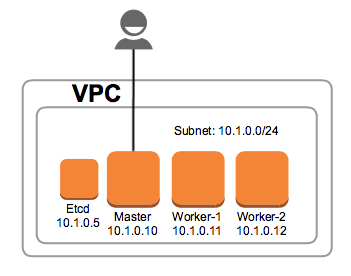

# Hardening Kubernetes from Scratch

The community continues to benefit from [Kubernetes the Hard Way](https://github.com/kelseyhightower/kubernetes-the-hard-way) by Kelsey Hightower in understanding how each of the components work together and are configured in a reasonably secure manner, step-by-step.  In a similar manner but using a slightly different approach, this guide attempts to demonstrate how the security-related settings inside ```kubernetes``` actually work from the ground up, one change at a time, validated by real attacks where possible.

By following this guide, you will configure one of the *least secure* clusters possible at the start. Each step will attempt to follow the pattern of a) educate, b) attack, c) harden, and d) verify in order of security importance and maturity.  Upon completion of the guide, you will have successfully hacked your cluster several times over and now fully understand all the necessary configuration changes to prevent each one from happening.

> The cluster built in this tutorial is not production ready--especially at the beginning--but the concepts learned are definitely applicable to your production clusters.

## Target Audience

The target audience for this tutorial is someone who has a working knowledge of running a Kubernetes cluster (or has completed the ```kubernetes-the-hard-way``` tutorial) and wants to understand how each security-related setting works at a deep level.

## Cluster Software Details

- [AWS EC2](https://aws.amazon.com/ec2/)
- [Ubuntu 16.0.4 LTS](http://cloud-images.ubuntu.com/locator/ec2/) and search for `16.04 LTS hvm:ebs-ssd`
- [Docker 1.13.x](https://www.docker.com)
- [CNI Container Networking](https://github.com/containernetworking/cni) 0.6.0
- [etcd](https://github.com/coreos/etcd) 3.2.11
- [Kubernetes](https://github.com/kubernetes/kubernetes) 1.9.2


## Pre-Requisite Tools

- AWS Account Credentials with permissions to:
  - Create/delete VPC (subnets, route tables, internet gateways)
  - Create/delete Cloudformation
  - Create/delete EC2 * (security groups, keypairs, instances)
- AWS cli tools configured to use said account
- bash
- git
- dig
- kubectl (v1.9.2)
- cfssl

## The (Purposefully) Insecure Cluster

### Cluster System Details

- Etcd - t2.micro (10.1.0.5)
- Master - t2.small (10.1.0.10)
- Worker1 - t2.small (10.1.0.11)
- Worker2 - t2.small (10.1.0.12)

AWS costs in `us-east-1` are just under $2/day.

### Diagram/Structure



To keep things simple, this guide is based on a single VPC, single availability zone, single subnet architecture where all nodes have static private IPs, are assigned public IPs to enable direct SSH access, and share a security group that allows each node to have full network access to each other.

### Labs

#### Build the Cluster

These steps will guide you through creating the VPC, subnet, instances, and basic cluster configuration without any hardening measures in place.  Pay special attention to the configuration of the security group to ensure only you have access to these systems!

1. [Create the VPC](docs/create-vpc.md)
2. [Launch and configure the `etcd` instance](docs/launch-configure-etcd.md)
3. [Launch and configure the `master` instance](docs/launch-configure-master.md)
4. [Launch and configure the `worker-1` and `worker-2` instance](docs/launch-configure-workers.md)
5. [Create the local `kubeconfig` file](docs/create-kubeconfig.md)

#### Level 0 Security

The following items are to be deployed to fulfill basic Kubernetes cluster functionality.  The steps purposefully omit any security-related configuration/hardening.

1. [Deploy kube-dns](docs/deploy-kube-dns.md)
2. [Deploy Heapster](docs/deploy-heapster.md)
3. [Deploy Dashboard](docs/deploy-basic-dashboard.md)

#### Level 0 Attacks

At this most basic level, "Level 0", the current configuration offers very little (if any) protection from attacks that can take complete control of the the cluster and its nodes.

1. [Enumerate exposed ports](docs/enumerate-ports.md) on the nodes and identify their corresponding services
2. [Probing Etcd](docs/direct-etcd.md) to compromise the data store
3. [Probing the Master](docs/direct-master.md)
4. [Probing the Worker](docs/direct-worker.md)

#### Level 1 Hardening

Ouch! The security configuration of "Level 0" is not resistant to remote attacks.  Let's do the very basic steps to prevent the "Level 0" attacks from being so straightforward.

1. Improve the security group configuration
2. Enable TLS on Etcd communications
3. Enable TLS on the externally exposed Kubernetes API

#### Deploy Application Workloads

With that modest amount of hardening, it's time to have this cluster perform some work.  To do that, we'll want to install [Helm](https://helm.sh) and its in-cluster helper, "Tiller".  With that in place, we'll deploy two sample applications via Helm Charts.

1. Install Helm/Tiller
2. Install the Vulnapp
3. Install the Azure Vote App

#### Level 1 Attacks

At this point, there are some fundamental resource exhaustion problems that authorized users may purposefully (or accidentally) trigger.  Without any boundaries in place, deploying too many pods or pods that consume too much CPU/RAM shares can cause serious cluster availability/Denial of Service issues.  When the cluster is "full", any new pods will not be scheduled.

1. Launch too many pods
2. Launch pods that consume too many CPU/RAM shares
#### Level 2 Hardening

In order to provide the proper boundaries around workloads and their resources, using separate namespaces and corresponding resource quotas can prevent the "Level 1" issues.  

1. Separate workloads using Namespaces
2. Set specific Request/Limits on Pods
3. Enforce Namespace Resource Quotas
5. Discuss multi-etcd, multi-master

#### Level 2 Attacks
1. Malicious Image, Compromised Container, Multi-tenant Misuse
  - Service Account Tokens
  - Dashboard Access
  - Tiller Access
  - Kubelet Exploit
  - Application Tampering
  - Metrics Scraping
  - Metadata API
  - Outbound Scanning/pivoting 

#### Level 3 Hardening
1. RBAC
2. New Dashboard
3. Separate Kubeconfigs per user
4. Tiller TLS
5. Kubelet Authn/z
6. Network Policy/CNI
7. Admission Controllers
8. Logging?

#### Level 4 Attacks
1. Malicious Image, Compromised Container, Multi-tenant Misuse
  - Escape the container

#### Level 4 Hardening
1. Advanced admission controllers
2. Restrict images/sources
3. Network Egress filtering
4. Vuln scan images
5. Pod Security Policy
6. Encrypted etcd
7. Sysdig Falco

### Clean Up
1. [Delete Instances](docs/delete-instances.md)
2. [Delete VPC](docs/delete-vpc.md)

## Next Steps
- [Kubernetes the Hard Way](https://github.com/kelseyhightower/kubernetes-the-hard-way) - Kelsey Hightower
